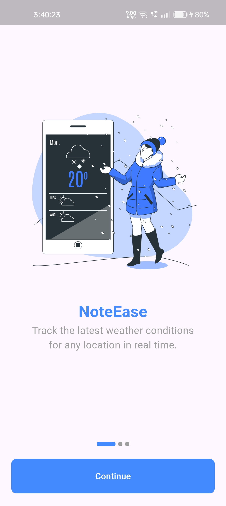
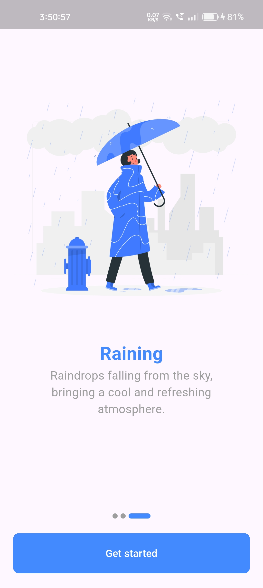
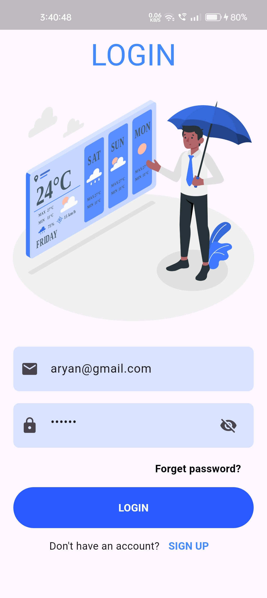
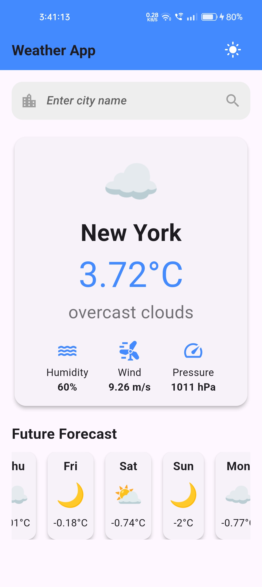
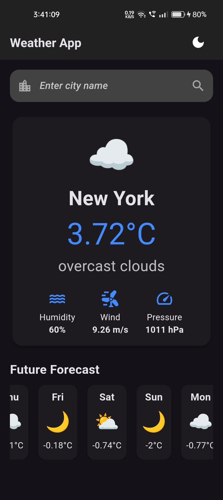

# Weather App

Weather App is a mobile application built using Flutter that provides real-time weather updates. The app leverages Firebase for backend services and OpenWeatherMap API to fetch weather data.

## Features
- Real-time weather updates
- Weather forecasts for multiple locations
- User-friendly interface
- Integration with Firebase for authentication and data storage

## Getting Started

### Prerequisites
- Flutter SDK: [Install Flutter](https://flutter.dev/docs/get-started/install)
- Firebase account: [Create Firebase Project](https://firebase.google.com/)
- OpenWeatherMap API key: [Get API Key](https://home.openweathermap.org/api_keys)

### Installation
1. Clone the repository:
    ```sh
    git clone https://github.com/yourusername/weatherapp.git
    cd weatherapp
    ```

2. Install dependencies:
    ```sh
    flutter pub get
    ```

3. Configure Firebase:
    - Follow the instructions to add Firebase to your Flutter app: [Add Firebase to your Flutter app](https://firebase.google.com/docs/flutter/setup)

4. Configure OpenWeatherMap API:
    - Create a file named `config.dart` in the [lib](http://_vscodecontentref_/0) directory and add your OpenWeatherMap API key:
    ```dart
    // filepath: lib/config.dart
    const String apiKey = 'YOUR_OPENWEATHERMAP_API_KEY';
    const String apiUrl = 'https://api.openweathermap.org/data/2.5/';
    ```

5. Run the app:
    ```sh
    flutter run
    ```

## Resources
- [Flutter Documentation](https://docs.flutter.dev/)
- [Firebase Documentation](https://firebase.google.com/docs)
- [OpenWeatherMap API Documentation](https://openweathermap.org/api)

---

<a></a>
<a></a>
<a></a>
<a></a>
<a></a>
<a></a>
<a></a>
<a></a>
<a></a>

---

## Connect

<a href="https://dev-aryanbhimani.pantheonsite.io/" target="_blank"></a>
<a href="https://www.linkedin.com/in/aryanbhimani/" target="_blank"></a>
<a href="https://twitter.com/yourtwitterhandle" target="_blank"></a> 

For queries or support, feel free to reach out:  
📞 **+91 9408962204**  
📧 **aryan.bhimani.93@email.com**

---
